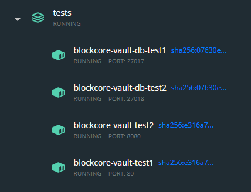

# Blockcore Vault Testing

You can run a multi-vault environment using the docker-compose.yml in this folder.

There are currently no way to have automatic reload of changes, but the following process can be 
used to build and deploy two instances locally:

```sh
npm run install
npm run build
docker build -t blockcore/blockcore-vault:latest -t blockcore/blockcore-vault:0.0.1 "."
cd tests
docker-compose up
```

When the containers are running, you can open the Docker Desktop dashboard and should see something like this:



Here you can see the ports for the MongoDB instances and the Blockcore Vault instances.